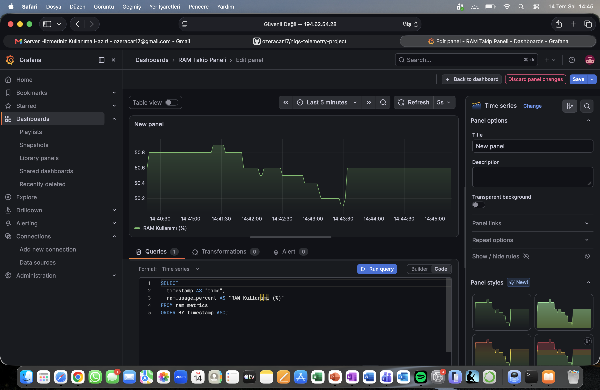
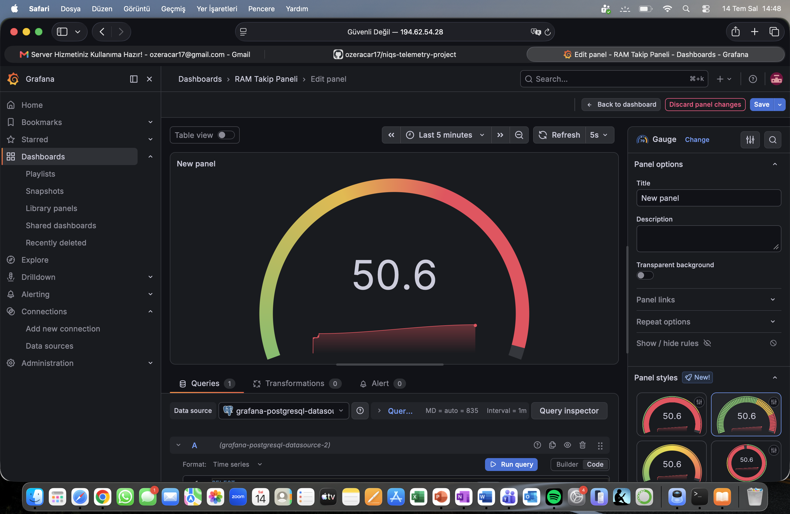
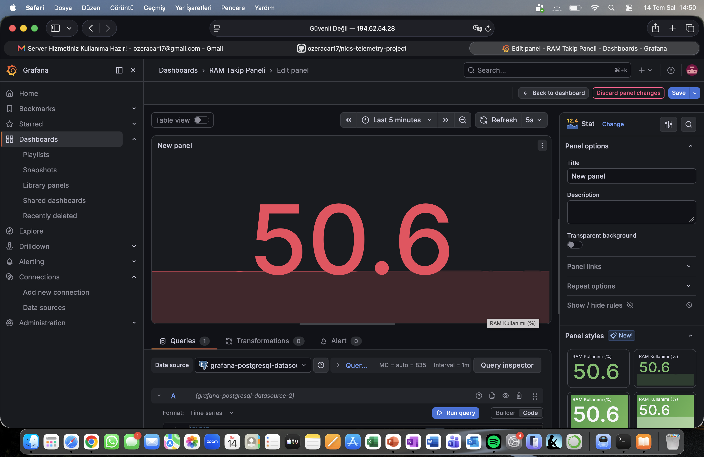

# NIQS Real-Time RAM Telemetry Pipeline 🚀

Bu proje; Docker üzerinde koşan Apache Kafka, PostgreSQL ve Grafana servislerini bir araya getirerek, bir sunucunun (VM) anlık RAM kullanım değerlerini saniyede bir okuyan, işleyen ve görselleştiren uçtan uca bir **Gerçek Zamanlı Veri Akış Hattı (Real-Time Data Pipeline)** çalışmasıdır.

---

## 🛠️ Kullanılan Teknolojiler

* **Python 3:** Sistem metriklerini okuyan Producer ve veritabanına yazan Consumer scriptleri.
* **Apache Kafka & Zookeeper:** Gerçek zamanlı veri kuyruğu ve mesajlaşma altyapısı.
* **PostgreSQL:** Zaman serisi verilerini güvenli ve ilişkisel olarak saklayan veritabanı (24 saatlik otomatik veri temizleme mekanizmasıyla birlikte).
* **Grafana:** Veritabanındaki anlık metrikleri görselleştiren canlı izleme paneli.
* **Docker & Docker Compose:** Tüm altyapıyı tek tıkla konteynerize eden ve yöneten sistem.

---

## 📊 Sistem Mimarisi & Canlı İzleme Panelleri

Sistem aktif olarak sunucunun RAM kullanımını saniyede bir ölçer ve Grafana arayüzüne aktarır. İşte projeden farklı görselleştirme kesitleri:

### 1. Canlı Sistem Metrikleri & SQL Sorgusu
SQL sorgusuyla doğrudan veritabanından çekilen anlık yumuşatılmış alan grafiği (Area Chart).


### 2. Endüstriyel Hız Göstergesi (Gauge View)
Sistem kaynaklarının kritik seviyelerini anlık takip etmek için tasarlanmış renkli gösterge paneli.


### 3. Minimalist Durum Paneli (Stat View)
Sadece güncel RAM kullanım yüzdesine odaklanan ve arka planda hafif geçmiş trend siluetini barındıran modern arayüz.


---

## 🚀 Projeyi Yerelde Çalıştırma

Projeyi kendi bilgisayarınızda veya sunucunuzda ayağa kaldırmak için aşağıdaki adımları sırasıyla uygulayabilirsiniz:

### 1. Depoyu Klonlayın
```bash
git clone [https://github.com/ozeracar17/niqs-telemetry-project.git](https://github.com/ozeracar17/niqs-telemetry-project.git)
cd niqs-telemetry-project

### 2. Docker Konteynerlerini Başlatın
docker-compose up -d

### 3. Python Servislerini Uyandırın
# Veri üreticisini başlat (Producer)
docker start niqs_producer_live
# Veri tüketicisini başlat (Consumer)
docker start niqs_consumer_live

